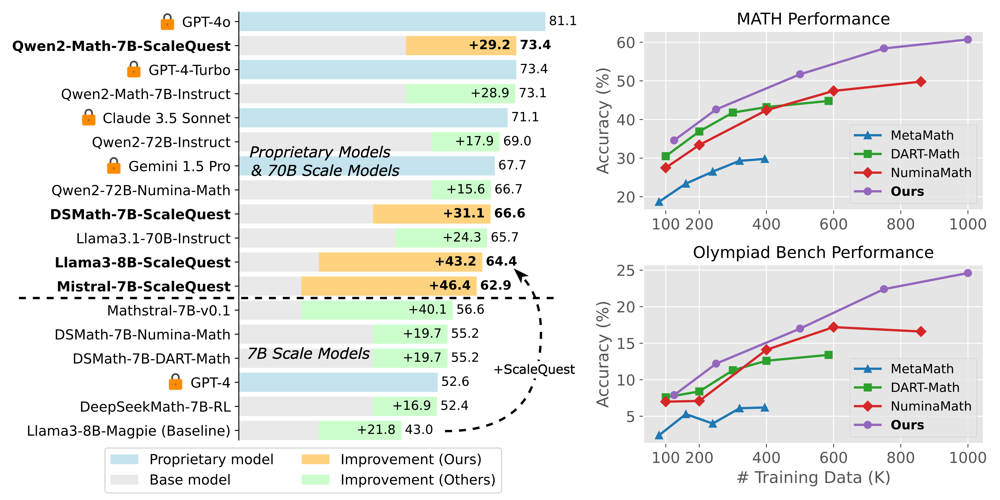

<p align="center">
<h1 align="center">Unleashing Reasoning Capability of LLMs<br>via Scalable Question Synthesis from Scratch</h1>

<p align="center">
    <a href="https://github.com/yyDing1/ScaleQuest/blob/main/LICENSE"></a>
    <a href="https://huggingface.co/collections/dyyyyyyyy/scalequest-670a7dc2623c91990f28913b"></a>
    <a href="https://scalequest.github.io/"></a>
    <a href="https://arxiv.org/abs/2410.18693"></a>
    <a href="https://opennlg.cn/"></a>
</p>

We introduce ScaleQuest, a scalable, cost-effective, and novel data synthesis method that utilizes small-size open-source models to generate questions from scratch without the need for seed data with complex augmentation constraints.



We release two question generator models and four problem-solving models.

| Model | Type | MATH | Olympiad Bench | 🤗 HuggingFace<br />Download Link |
| - | :-: | :-: | :-: | :-: |
| ScaleQuest-DeepSeekMath-7B-QGen | question generator | - | - | [link](https://huggingface.co/dyyyyyyyy/ScaleQuest-DeepSeekMath-7B-QGen)
| ScaleQuest-Qwen2-Math-7B-QGen | question generator | - | - | [link](https://huggingface.co/dyyyyyyyy/ScaleQuest-Qwen2-Math-7B-QGen)
| Mistral-7B-ScaleQuest | problem solver | 62.9 | 26.8 | [link](https://huggingface.co/dyyyyyyyy/Mistral-7B-ScaleQuest) |
| Llama3-8B-ScaleQuest | problem solver | 64.4 | 25.3 | [link](https://huggingface.co/dyyyyyyyy/Llama3-8B-ScaleQuest) |
| DeepSeekMath-7B-ScaleQuest | problem solver | 66.6 | 29.9 | [link](https://huggingface.co/dyyyyyyyy/DeepSeekMath-7B-ScaleQuest) |
| Qwen2-Math-7B-ScaleQuest | problem solver | 73.4 | 38.5 | [link](https://huggingface.co/dyyyyyyyy/Qwen2-Math-7B-ScaleQuest) |

This repository contains our complete data synthesis method, including:

## Step 0: Requirements

You should install the dependencies:

```bash
conda create -n scalequest python=3.11
conda activate scalequest
pip install -r requirements.txt
pip install flash-attn --no-build-isolation
```


## Demo Usage

Below is an question generator exmaple using `ScaleQuest-Qwen2-Math-7B-QGen`
```python
from vllm import LLM, SamplingParams

model_name = "dyyyyyyyy/ScaleQuest-Qwen2-Math-7B-QGen"
pre_query_template = "<|im_start|>system\nYou are a helpful assistant.<|im_end|>\n<|im_start|>user\n"
stop_tokens = ["<|im_start|>", "<|im_end|>", "<|endoftext|>"]
llm = LLM(
    model=model_name,
    tokenizer=model_name,
    tensor_parallel_size=1,
    max_model_len=4096,
    enable_prefix_caching=True,
    trust_remote_code=True,
    swap_space=16,
    gpu_memory_utilization=0.95,
)
sampling_params = SamplingParams(
    n=4,
    max_tokens=1024,
    temperature=1.0,
    top_p=0.99,
    stop=stop_tokens,
)
outputs = llm.generate(pre_query_template, sampling_params)
# Print the outputs.
for output in outputs:
    prompt = output.prompt
    for idx, generated_output in enumerate(output.outputs):
        generated_text = generated_output.text
        print(f"Sample {idx + 1}:")
        print(f"Prompt: {prompt!r}")
        print(f"Generated text: {generated_text!r}")
        print("-" * 50)
```

Below is an problem solver example using `Qwen2-Math-7B-ScaleQuest`

```python
import torch
from transformers import AutoModelForCausalLM, AutoTokenizer

model_name = "dyyyyyyyy/Qwen2-Math-7B-ScaleQuest"

model = AutoModelForCausalLM.from_pretrained(
    model_name,
    torch_dtype=torch.bfloat16,
    device_map="auto"
)
tokenizer = AutoTokenizer.from_pretrained(model_name)

question = "Find the value of $x$ that satisfies the equation $4x+5 = 6x+7$."

sys_prompt = "<|im_start|>system\nYou are a helpful assistant.<|im_end|>\n"
query_prompt = "<|im_start|>user" + "\n"
# {query}
prompt_after_query = "\n" + "Please reason step by step, and put your final answer within \\boxed{}.<|im_end|>" + "\n"
resp_prompt = "<|im_start|>assistant" + "\n"
prompt_before_resp = ""
# {resp}
delim = "<|im_end|>" + "\n"

prefix_prompt = f"{query_prompt}{question}{prompt_after_query}{resp_prompt}{prompt_before_resp}".rstrip(" ")
full_prompt = sys_prompt + delim.join([prefix_prompt])

# print(full_prompt)

inputs = tokenizer(full_prompt, return_tensors="pt").to(model.device)
outputs = model.generate(**inputs, max_new_tokens=512, do_sample=False)
print(tokenizer.decode(outputs[0][len(inputs.input_ids[0]):], skip_special_tokens=True))
```

## Step 1: Train Query Generators

1. Training a question generator through question fine-tuning (code in the `src/train_question_generator/qft_train` folder).
2. Constructing preference data (code in the `src/train_question_generator/question_optim` folder) and performing question preference optimization (code in the `src/train_question_generator/qpo_train` folder).

You can run QFT and QPO by the following command:

```bash
cd src/train_question_generator && bash scripts/run_dsmath_qft.sh
cd src/train_question_generator && bash scripts/run_qwen2math_qft.sh
```

## Step 2: Question Synthesis

1. Using the trained question generator to synthesize questions (code in the `src/data_generation` folder).
2. Applying a filtering process to the generated questions (code in the `src/data_generation/question_filtering` folder).

```bash
cd src/data_generation && bash scripts/run.sh
```

## Step 3: Response Synthesis

1. Generating responses (code in the `src/data_generation` folder) and applying a reward filtering strategy (code in the `src/data_generation/reward_filtering` folder).
2. For instruction-tuning and evaluation, we directly use the DART-Math framework.

```bash
cd src/data_generation && bash scripts/run.sh
```

## Citation

```
@article{ding2024unleashing,
  title={Unleashing Reasoning Capability of LLMs via Scalable Question Synthesis from Scratch},
  author={Ding, Yuyang and Shi, Xinyu and Liang, Xiaobo and Li, Juntao and Zhu, Qiaoming and Zhang, Min},
  journal={arXiv preprint arXiv:2410.18693},
  year={2024}
}
```
